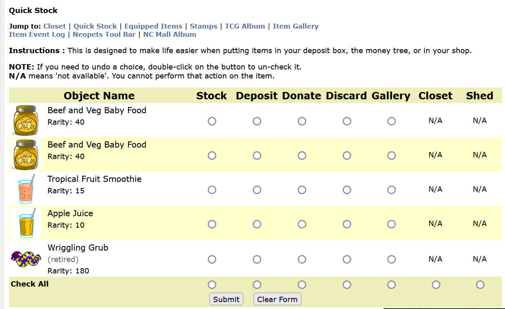

# Neopets Userscripts

This is a set of basic scripts to help out with UI enhancements on various parts of Neopets.

> **⚠️ Use with caution**
>
> Use external scripts at your own risk! Using these scripts may or may not violate the Neopets terms of service.
>
> As with any script provided by someone you don't know, I highly recommend that you _look through the source code_ yourself.
> If you don't understand what you're installing, you could be installing something that could put your account at risk!

## Requirements

### You must first install [the Tampermonkey extension](https://chrome.google.com/webstore/detail/tampermonkey/dhdgffkkebhmkfjojejmpbldmpobfkfo) on Chrome

You may also be able to use this on other browsers using Tampermonkey or Greasemonkey equivalent extensions. These scripts have only been tested in Chrome on a computer (and not on any mobile devices).

## The Scripts

- [Stock Highlighter](#stock-highlighter): Cleans up your Stock Portfolio
- [Bargain Stocks Helper](#bargain-stocks-helper): Helps you find stocks to purchase for the day
- [Stock Purchase Helper](#stock-purchase-helper): Helps you make sure you're purchasing the right stocks at the right price
- [Fancy Quickstock](#fancy-quickstock): Adds item images and info the the Quickstock page
- [Training Helper](#training-helper): Helps you track when your pet will be done with codestone or dubloon training

### Stock Highlighter

Sorts your stock portfolio with stocks listed by value, including configurable options to set your sell point, highlight color, etc. Also moves the PIN entry for selling stocks to the top of the screen.

(requires [Tampermonkey](https://chrome.google.com/webstore/detail/tampermonkey/dhdgffkkebhmkfjojejmpbldmpobfkfo))

#### Screenshots

 

### Bargain Stocks Helper

Adds a list of stocks that are at the minimum purchase price. This shows up on all stock pages as long as the ticker marquee is at the top of the page.

The default minimum price is 15 NP, but can be configured.

(requires [Tampermonkey](https://chrome.google.com/webstore/detail/tampermonkey/dhdgffkkebhmkfjojejmpbldmpobfkfo))

#### Screenshots

### Stock Purchase Helper

Shows the price of the stock you're buying on the purchase page

(requires [Tampermonkey](https://chrome.google.com/webstore/detail/tampermonkey/dhdgffkkebhmkfjojejmpbldmpobfkfo))

#### Screenshots

### Fancy Quickstock

Adds item images and information to the quickstock page.

Gathers data from your inventory page, so that when you visit the quick stock page it can display item images and rarity. Makes it way easier to tell what items you're stashing!

(requires [Tampermonkey](https://chrome.google.com/webstore/detail/tampermonkey/dhdgffkkebhmkfjojejmpbldmpobfkfo))

### Screenshots

### Training Helper

Makes codestone training your pet require fewer clicks and less math. Will send browser notifications when training is complete.

(requires [Tampermonkey](https://chrome.google.com/webstore/detail/tampermonkey/dhdgffkkebhmkfjojejmpbldmpobfkfo))

#### Screenshots

<table><tr><td></td>
<td></td></tr>
<tr><td></td><td></td></tr></table>

#### Features
* Partial[^1] multi-language[^2] support (based on current language on Neopets)
* Allows you to start a training course from the status page in each of the three training schools
* Lets you search the shop wiz (SSW if you have premium) or your SDB for codestones and dubloons with a single click  
* Automatically recommends the next stat you should train (note: does not currently recommend optimized hitpoint levelling to minimize codestone use, instead it recommends your lowest stat and level only when necessary)
* Shows a live countdown of how much time you have left in your course
* Allows you to opt in to notifications when your pet's training is complete (note: the notification requires that you keep the browser tab open, there is no way to schedule a notification outside of the script)
* Shows your training results directly on the page when you complete a course
* Notifies you when it's your pet's birthday, to remind you to get your birthday muffin from their lookup
* Notifies you if your pet is eligible for free training in the Swashbuckling Academy during the pet's official species day
* Functions with or without Neopets Premium
* Functions with or without a Training Fortune Cookie active

[^1]: Currently, the user interface items are not translated and display in English. Not all features are fully tested in all languages.
[^2]: Does not support Chinese, Japanese, or Korean scripts, as the item names in Neopets are broken. In German and French, the countdown ticker does not function correctly right now.
