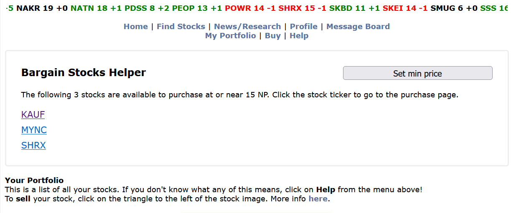

# Neopets Userscripts
This is a set of basic scripts to help out with UI enhancements on various parts of Neopets. 

> **⚠️ Use with caution**
>
> Use external scripts at your own risk! Using these scripts may or may not violate the Neopets terms of service.
> 
> As with any script provided by someone you don't know, I highly recommend that you *look through the source code* yourself.
> If you don't understand what you're installing, you could be installing something that could put your account at risk!

## Requirements

### You must first install [the Tampermonkey extension](https://chrome.google.com/webstore/detail/tampermonkey/dhdgffkkebhmkfjojejmpbldmpobfkfo) on Chrome

You may also be able to use this on other browsers using Tampermonkey or Greasemonkey equivalent extensions. These scripts have only been tested in Chrome on a computer (and not on any mobile devices).

## The Scripts

### Stock Highlighter
Sorts your stock portfolio with stocks listed by value, including configurable options to set your sell point, highlight color, etc. Also moves the PIN entry for selling stocks to the top of the screen.

(requires [Tampermokney](https://chrome.google.com/webstore/detail/tampermonkey/dhdgffkkebhmkfjojejmpbldmpobfkfo))

#### Screenshots
 

### Bargain Stocks Helper
Adds a list of stocks that are at the minimum purchase price. This shows up on all stock pages as long as the ticker marquee is at the top of the page.

The default minimum price is 15 NP, but can be configured.

(requires [Tampermokney](https://chrome.google.com/webstore/detail/tampermonkey/dhdgffkkebhmkfjojejmpbldmpobfkfo))

#### Screenshots

### Stock Purchase Helper
Shows the price of the stock you're buying on the purchase page

(requires [Tampermokney](https://chrome.google.com/webstore/detail/tampermonkey/dhdgffkkebhmkfjojejmpbldmpobfkfo))

#### Screenshots

---

### Training Helper
Makes codestone training your pet require fewer clicks and less math. Will send browser notifications training is complete.

(requires [Tampermokney](https://chrome.google.com/webstore/detail/tampermonkey/dhdgffkkebhmkfjojejmpbldmpobfkfo))

> Disclaimer: This script has not been tested in quite a number of years!
